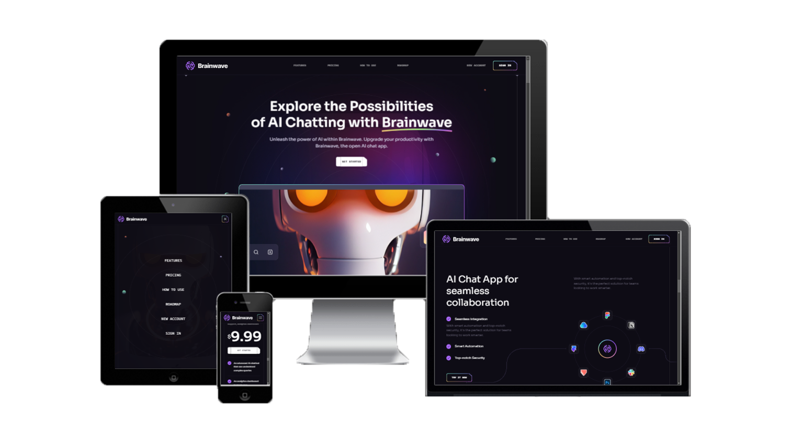

### 

# :robot: Meals Application

### _ai-Brainwave , React + Vite !!_

### Link :link: [https://ai-brainwave.netlify.app/](https://rak-ai-brainwave.netlify.app/)

## Interface

## Run Locally

  - Run This command `https://github.com/developer-rak/ai_brainwave.git`
  - You are now in the dev environment and you can play around

## ✨ Features

  - FEATURES
  - PRICING
  - HOW TO USE
  - ROADMAP

  - NEW ACCOUNT
  - SIGNUP

## ⚙️ Tech Stack
  - React + Vite
  - TailwindCss
  - Netlify

# React + Vite

This template provides a minimal setup to get React working in Vite with HMR and some ESLint rules.

Currently, two official plugins are available:

- [@vitejs/plugin-react](https://github.com/vitejs/vite-plugin-react/blob/main/packages/plugin-react/README.md) uses [Babel](https://babeljs.io/) for Fast Refresh
- [@vitejs/plugin-react-swc](https://github.com/vitejs/vite-plugin-react-swc) uses [SWC](https://swc.rs/) for Fast Refresh
